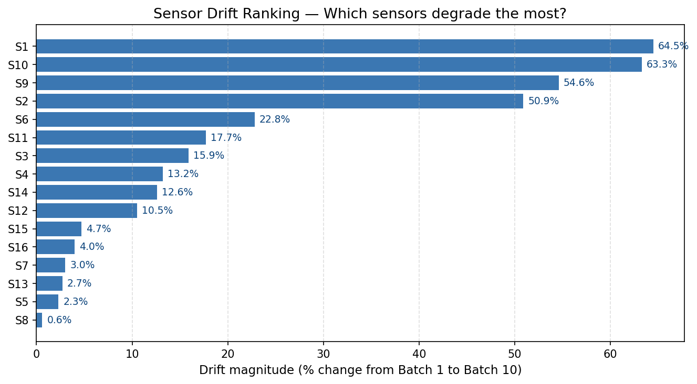
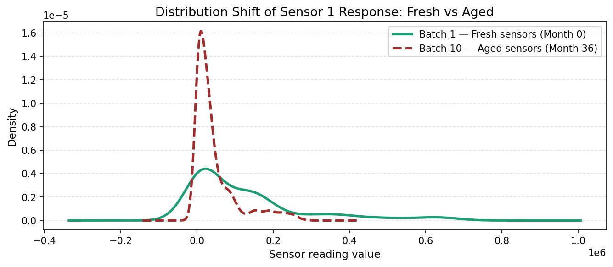
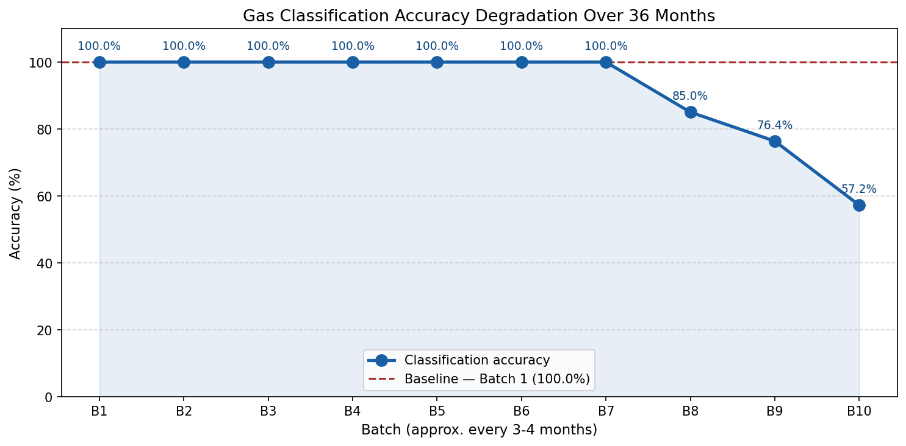
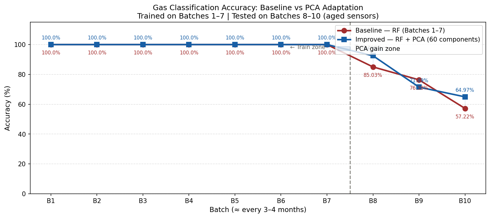
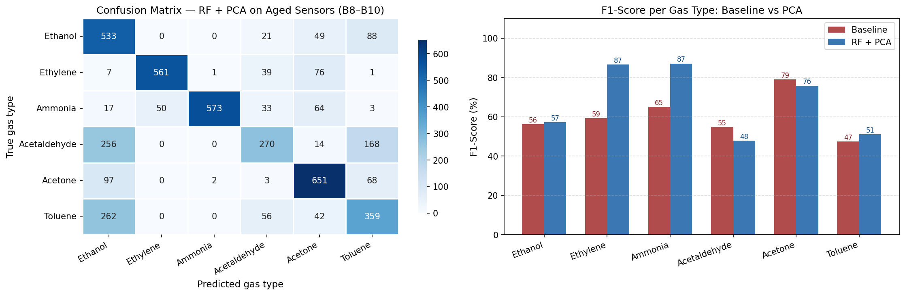
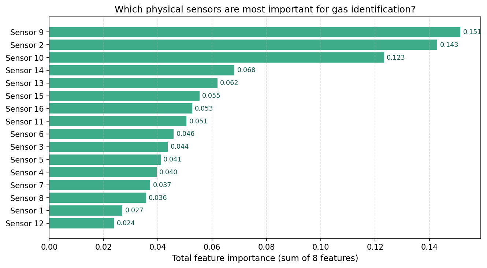
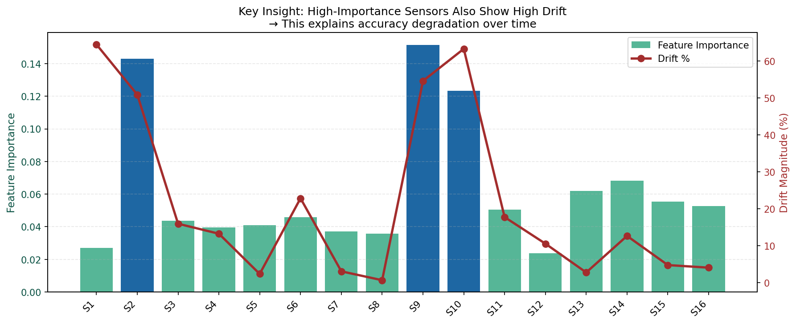
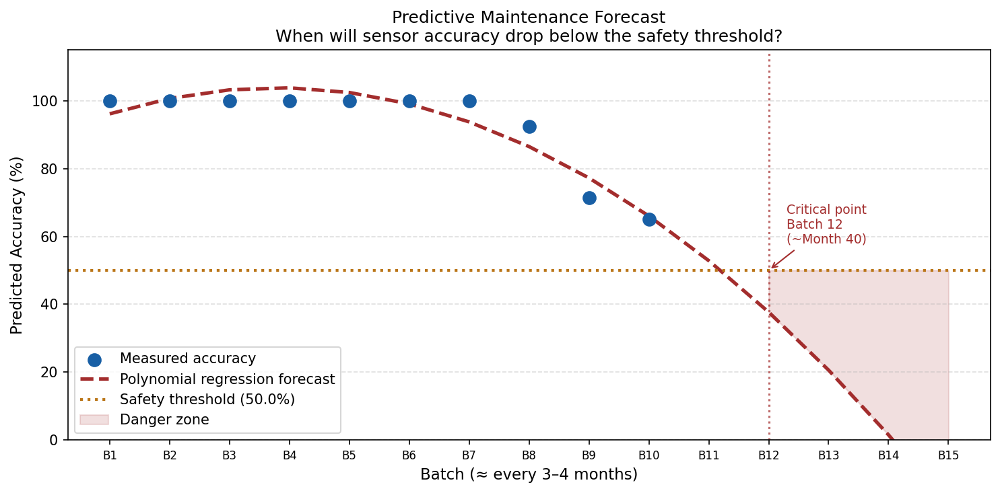
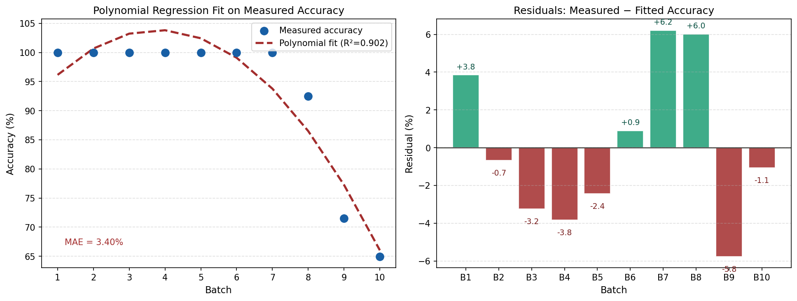

# Gas Sensor Array Drift — Industrial Safety Analysis

> **Applied Mathematics Engineering | NHSM**  
> Dataset: Gas Sensor Array Drift (UCI Machine Learning Repository)  
> Application: Predictive Maintenance & Gas Detection for Oil & Gas Industry

---

## Problem Statement

Metal-oxide gas sensors degrade over time — a phenomenon known as **sensor drift**.
A classification model trained on fresh sensors progressively loses accuracy as hardware ages.

This project addresses three industrial questions:

1. **Which sensors drift the most** over 36 months, and by how much?
2. **Can we still classify gas types correctly** on aged, drifted sensors?
3. **When should sensors be replaced** before accuracy drops below the safety threshold?

> Direct relevance to SONATRACH: pipeline leak detection, refinery gas monitoring,
> and data-driven sensor maintenance scheduling.

---

## Dataset

| Property | Value |
|---|---|
| Name | Gas Sensor Array Drift Dataset |
| Source | UCI Machine Learning Repository |
| Sensors | 16 metal-oxide sensors |
| Features | 128 per sample (16 sensors × 8 statistical features) |
| Gas classes | 6 — Ethanol, Ethylene, Ammonia, Acetaldehyde, Acetone, Toluene |
| Batches | 10 batches collected over 36 months |
| Total samples | 13,910 |

---

## Repository Structure

```
Gas-Sensor-Drift/
│
├── notebook/
│   └── Gas_Sensor_Drift_SONATRACH.ipynb     # Full notebook (Parts 1–3)
│
├── figures/
│   ├── sensor_signal_drift_per_sensor.png   # Part 1 — 16-panel drift curves
│   ├── distribution_shift.png               # Part 1 — KDE Batch 1 vs Batch 10
│   ├── sensor_drift_ranking.png             # Part 1 — drift % ranking
│   ├── accuracy_drift_curve.png             # Part 2 — accuracy degradation over 10 batches
│   ├── baseline_vs_pca_accuracy.png         # Part 2 — baseline vs PCA model comparison
│   ├── confusion_matrix_f1_comparison.png   # Part 2 — confusion matrix + F1 per gas
│   ├── feature_importance.png               # Part 2 — most informative sensors
│   ├── drift_vs_importance_insight.png      # Part 2 — key scientific finding
│   ├── predictive_maintenance_forecast.png  # Part 3 — replacement schedule forecast
│   ├── regression_results.png               # Part 3 — regression fit & residuals
│   └── accuracy_per_gas.png                 # Part 3 — per-gas accuracy on aged sensors
│
└── README.md
```

---

## Part 1 — Sensor Drift Analysis

**Goal:** Quantify how each sensor's signal changes over 36 months.

**Methods:** Mean response curves per batch, KDE distribution shift, drift magnitude ranking.



**Top 3 most drifted sensors:**

| Rank | Sensor | Drift Magnitude |
|------|--------|----------------|
| 1 | S1 | 64.5% |
| 2 | S10 | 63.3% |
| 3 | S9 | 54.6% |



The KDE plot shows how the entire statistical distribution of Sensor 1 readings
shifts between fresh sensors (Batch 1, Month 0) and aged sensors (Batch 10, Month 36).

---

## Part 2 — Gas Classification Despite Sensor Drift

**Goal:** Build a model that correctly identifies gas type on aged, drifted sensors.

**Strategy:** Train on early batches (fresh sensors), test on late batches (aged sensors).
Apply PCA-based domain adaptation to reduce drift-induced noise.

### Results

| Strategy | Training data | Accuracy on B8–B10 |
|---|---|---|
| Naive baseline | Batches 1–3 only | 37.28% |
| Extended training | Batches 1–7 | 61.16% |
| **RF + PCA (60 components)** | **Batches 1–7** | **67.53%** |

> PCA retains **99.9% of variance** while compressing 128 → 60 dimensions,
> effectively filtering drift-induced noise before classification.



The chart above shows classification accuracy per batch when using the baseline model trained on Batches 1–7 only — illustrating the raw impact of drift on a naive approach.



At Batch 10 (36 months of aging): Baseline drops to 57.22% → PCA model holds at **64.97%** (+7.75%)

### Per-Gas Accuracy on Aged Sensors (RF + PCA)

| Gas | Accuracy | Status |
|---|---|---|
| Ethylene | 81.9% | ✓ Good |
| Acetone | 79.3% | ✓ Good |
| Ammonia | 77.4% | ✓ Good |
| Ethanol | 77.1% | ✓ Good |
| Toluene | 49.9% | ✗ Needs improvement |
| Acetaldehyde | 38.1% | ✗ Needs improvement |



### Feature Importance



Aggregated importance (sum of 8 features) per physical sensor — identifying which sensors the classifier relies on most.

### Key Scientific Finding



**S9 and S10 are simultaneously the most important sensors for classification
(importance: 0.151 and 0.123) and among the most drifted (54.6% and 63.3%).**

This explains the accuracy degradation mechanism: the model depends heavily on
the least stable sensors. This finding directly guides hardware prioritization —
S9 and S10 should be recalibrated or replaced first.

---

## Part 3 — Predictive Maintenance Forecast

**Goal:** Forecast when sensor accuracy will drop below the industrial safety threshold,
enabling data-driven maintenance scheduling instead of fixed-interval replacement.

**Method:** Polynomial regression (degree 2) fitted on the measured accuracy curve,
extrapolated to future batches.

**Regression fit:** R² = 0.9018 | MAE = 3.40%



The model identifies the **critical batch** where accuracy drops below 50%,
giving operators advance warning for sensor replacement scheduling.



---

## Summary

| Part | Method | Key Result |
|---|---|---|
| Sensor Drift Analysis | Descriptive stats + KDE | S1, S9, S10 drift 54–65% over 36 months |
| Gas Classification | Random Forest + PCA (60 components) | 67.53% on aged sensors — +30% vs naive baseline |
| Predictive Maintenance | Polynomial Regression | R² = 0.90 — data-driven replacement forecast |

---

## Skills Demonstrated

- Manual LibSVM data parsing (no external parser dependency)
- Exploratory data analysis and multi-panel visualization
- Dimensionality reduction (PCA) for domain adaptation
- Classification under distribution shift
- Predictive maintenance regression modeling
- Industrial safety application of machine learning

---

## How to Run

1. Clone this repository
2. Download the dataset from [UCI ML Repository](https://archive.ics.uci.edu/dataset/224/gas+sensor+array+drift+dataset)
   or from [Kaggle](https://www.kaggle.com/datasets/uciml/gas-sensor-array-drift-dataset)
3. Update `dataset_path` in the notebook to point to the extracted `Dataset/` folder
4. Run all cells in order (Parts 1 → 2 → 3)

**Requirements:** `numpy`, `pandas`, `matplotlib`, `seaborn`, `scikit-learn`

```bash
pip install numpy pandas matplotlib seaborn scikit-learn
```

---

*National High School of Mathematics (NHSM) — Applied Mathematics Engineering*  
*Project supervised within the framework of SONATRACH recruitment preparation*
